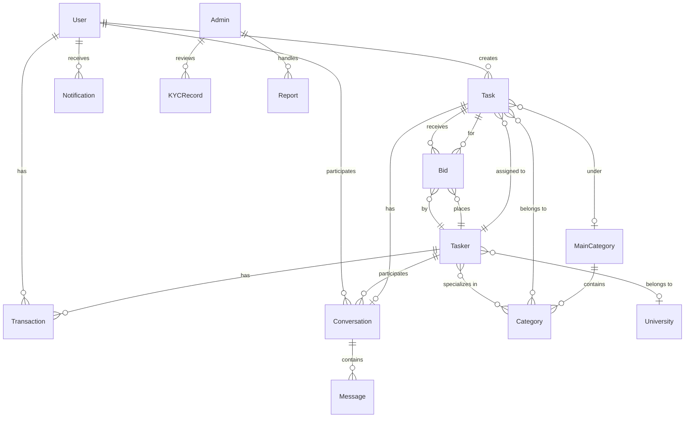
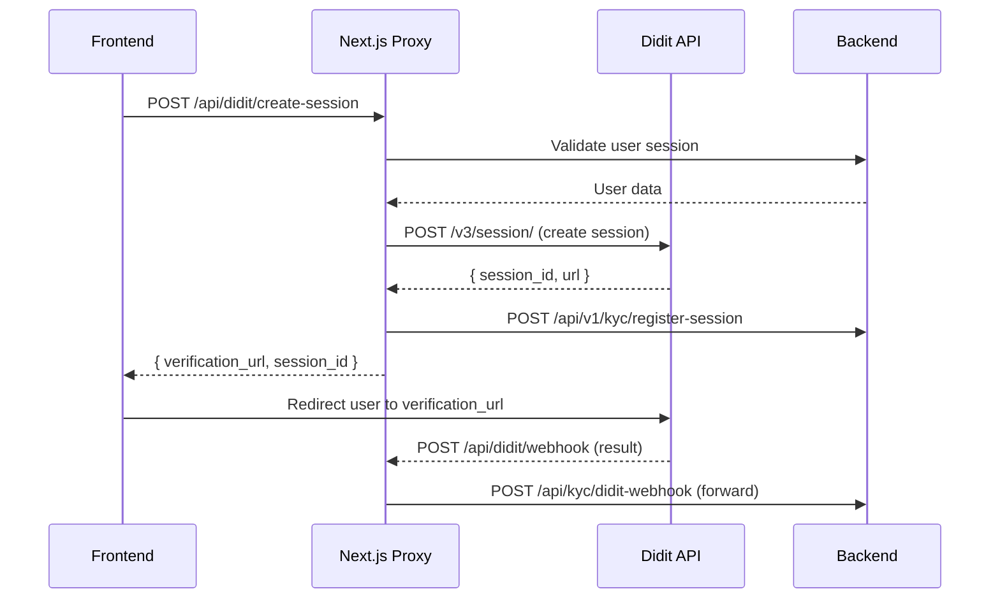

# TaskHub API Documentation

> **Version:** 1.0  
> **Generated:** 2026-06-05  
> **Source:** Derived from codebase analysis — no assumed endpoints.

---

## Table of Contents

1. [Overview](#overview)
2. [Authentication & Authorization](#authentication--authorization)
3. [Request & Response Conventions](#request--response-conventions)
4. [Error Handling](#error-handling)
5. [Pagination](#pagination)
6. [Endpoint Groups](#endpoint-groups)
   - [1 — Authentication](#1--authentication)
   - [2 — Email Verification](#2--email-verification)
   - [3 — Password Management](#3--password-management)
   - [4 — Profiles](#4--profiles)
   - [5 — Identity Verification (KYC)](#5--identity-verification-kyc)
   - [6 — Tasks](#6--tasks)
   - [7 — Bids](#7--bids)
   - [8 — Chat & Messaging](#8--chat--messaging)
   - [9 — Wallet & Payments](#9--wallet--payments)
   - [10 — Notifications](#10--notifications)
   - [11 — Categories](#11--categories)
   - [12 — Taskers](#12--taskers)
   - [13 — Waitlist & Support](#13--waitlist--support)
   - [14 — Admin Panel](#14--admin-panel)
7. [Data Models](#data-models)
8. [File Upload Conventions](#file-upload-conventions)
9. [Didit KYC Integration](#didit-kyc-integration)

---

## Overview

**TaskHub** is a task marketplace platform connecting two primary user types:

| Role | Description |
|------|-------------|
| **User** | Posts tasks, manages budgets, accepts bids, funds wallet |
| **Tasker** | Browses tasks, places bids, completes work, withdraws earnings |
| **Admin** | Full platform management — users, taskers, tasks, payments, KYC, reports |

### Base URL

```
Production : Configured via NEXT_PUBLIC_API_BASE_URL environment variable
Development: http://localhost:3009
```

All endpoints are prefixed with the base URL. Endpoint paths in this document are relative to the base URL (e.g., `/api/auth/user-login`).

### Currency

All monetary amounts are in **Nigerian Naira (NGN)** unless otherwise noted. The platform also supports Stellar (USDC) for crypto deposits and withdrawals.

### Platform Fee

A **15% platform fee** is deducted from task payments to taskers.

---

## Authentication & Authorization

### Authentication Method

**JWT Bearer Token** — obtained via login or Google OAuth.

```
Authorization: Bearer <token>
```

Tokens are stored client-side in `localStorage` under the key `token`. The user type (`user`, `tasker`, `admin`) is stored under `userType`.

### Login Flows

| Flow | Endpoint | Description |
|------|----------|-------------|
| User Login | `POST /api/auth/user-login` | Email + password login for Users |
| Tasker Login | `POST /api/auth/tasker-login` | Email + password login for Taskers |
| Admin Login | `POST /api/admin/auth/login` | Email + password login for Admins |
| Google Sign-In | `POST /api/auth/google` | Google OAuth with ID token |
| Google Complete Signup | `POST /api/auth/google/complete-signup` | Complete profile after initial Google sign-in |

### Authorization Model

| Role | Access Level |
|------|-------------|
| **Public** | Unauthenticated — categories listing, waitlist join, support tickets |
| **User** | Authenticated user — post tasks, manage bids, fund wallet |
| **Tasker** | Authenticated tasker — browse feed, place bids, withdraw earnings |
| **Admin** | Authenticated admin with role-based access: `super_admin`, `operations`, `trust_safety`, `finance` |

### Token Behavior

- On **401 Unauthorized** response, the client clears `token` and `userType` from `localStorage` and redirects to `/login`
- Certain endpoints use `skipAuthError: true` to suppress automatic logout on 401 (e.g., verification status checks)

---

## Request & Response Conventions

### Request Format

| Content-Type | Usage |
|-------------|-------|
| `application/json` | Default for all non-file requests |
| `multipart/form-data` | File uploads (profile pictures, task images, previous work, chat attachments) |

When sending `FormData`, the `Content-Type` header is omitted to allow the browser to set the multipart boundary automatically.

### Query Parameters

Query parameters are appended as URL search params for `GET` requests. Undefined/null values are excluded.

### Standard Response Envelope

Most endpoints return:

```json
{
  "status": "success",
  "message": "Operation description",
  "data": { ... }
}
```

Some endpoints return data at the root level without wrapping in `data`. The client handles both patterns.

### File Download Responses

Endpoints that return files (CSV, PDF, Excel) return:
- `Content-Type`: `text/csv`, `application/pdf`, `application/vnd.openxmlformats-officedocument.spreadsheetml.sheet`, or `application/octet-stream`
- `Content-Disposition`: `attachment; filename="..."` (optional)
- Body: Binary blob

---

## Error Handling

### Standard Error Format

```json
{
  "message": "Human-readable error description"
}
```

### HTTP Status Codes

| Code | Meaning | Usage |
|------|---------|-------|
| `200` | OK | Successful operation |
| `201` | Created | Resource created |
| `204` | No Content | Successful operation with no response body |
| `400` | Bad Request | Validation failed, missing fields |
| `401` | Unauthorized | Missing, invalid, or expired token |
| `403` | Forbidden | Insufficient permissions |
| `404` | Not Found | Resource does not exist |
| `500` | Internal Server Error | Server-side failure |

### Network Error Handling

Client-side detection of network errors (DNS failure, connection refused, etc.) surfaces as:

```json
{
  "message": "Network Error. Try again.",
  "code": "NETWORK_ERROR"
}
```

---

## Pagination

Paginated endpoints use query parameters:

| Parameter | Type | Default | Description |
|-----------|------|---------|-------------|
| `page` | number | 1 | Current page number |
| `limit` | number | 20 | Items per page |

### Paginated Response Format

```json
{
  "pagination": {
    "currentPage": 1,
    "totalPages": 5,
    "totalItems": 100,
    "hasNext": true,
    "hasPrev": false
  }
}
```

Some endpoints use cursor-based pagination:

| Parameter | Type | Description |
|-----------|------|-------------|
| `cursor` | string | Opaque cursor for next page |

---

## Endpoint Groups

---

### 1 — Authentication

---

#### User Login

```
POST /api/auth/user-login
```

Authenticates a User and returns a JWT token.

**Authentication:** Public

**Payload:**

```json
{
  "emailAddress": "user@example.com",
  "password": "securePassword123"
}
```

| Field | Type | Required | Description |
|-------|------|----------|-------------|
| emailAddress | string | Yes | User's registered email |
| password | string | Yes | User's password |

**Success Response (200):**

```json
{
  "status": "success",
  "message": "Login successful",
  "token": "eyJhbGciOiJIUzI1NiIs...",
  "user": {
    "_id": "6123abc...",
    "fullName": "John Doe",
    "emailAddress": "user@example.com",
    "isEmailVerified": true,
    "role": "user"
  }
}
```

| Field | Type | Description |
|-------|------|-------------|
| status | string | `"success"` or `"error"` |
| token / accessToken | string | JWT access token |
| user | object | User profile data |

**Error Responses:**

| Status | Body |
|--------|------|
| 400 | `{ "message": "Invalid credentials" }` |
| 401 | `{ "message": "Unauthorized" }` |

**Example Request:**

```bash
curl -X POST https://api.taskhub.com/api/auth/user-login \
  -H "Content-Type: application/json" \
  -d '{"emailAddress":"user@example.com","password":"securePassword123"}'
```

**Notes:**
- Token is stored in `localStorage` under key `token`
- User type `"user"` is stored under key `userType`

---

#### Tasker Login

```
POST /api/auth/tasker-login
```

Authenticates a Tasker and returns a JWT token.

**Authentication:** Public

**Payload:**

```json
{
  "emailAddress": "tasker@example.com",
  "password": "securePassword123"
}
```

| Field | Type | Required | Description |
|-------|------|----------|-------------|
| emailAddress | string | Yes | Tasker's registered email |
| password | string | Yes | Tasker's password |

**Success Response (200):**

```json
{
  "status": "success",
  "message": "Login successful",
  "token": "eyJhbGciOiJIUzI1NiIs...",
  "tasker": {
    "_id": "6123def...",
    "firstName": "Jane",
    "lastName": "Smith",
    "emailAddress": "tasker@example.com",
    "role": "tasker"
  }
}
```

**Notes:**
- Token is stored in `localStorage` under key `token`
- User type `"tasker"` is stored under key `userType`

---

#### User Registration

```
POST /api/auth/user-register
```

Registers a new User account.

**Authentication:** Public

**Payload:**

```json
{
  "fullName": "John Doe",
  "emailAddress": "user@example.com",
  "password": "securePassword123",
  "phoneNumber": "+2348012345678",
  "country": "Nigeria",
  "residentState": "Lagos",
  "address": "123 Main Street",
  "dateOfBirth": "1990-01-15"
}
```

| Field | Type | Required | Description |
|-------|------|----------|-------------|
| fullName | string | Yes | User's full name |
| emailAddress | string | Yes | Email address |
| password | string | Yes | Password |
| phoneNumber | string | Yes | Phone number |
| country | string | No | Country of residence |
| residentState | string | No | State of residence |
| address | string | No | Physical address |
| dateOfBirth | string | No | Date of birth (ISO format) |

**Success Response (201):**

```json
{
  "status": "success",
  "message": "Registration successful. Please verify your email.",
  "emailVerificationRequired": true,
  "user": {
    "_id": "6123abc...",
    "fullName": "John Doe",
    "emailAddress": "user@example.com"
  }
}
```

| Field | Type | Description |
|-------|------|-------------|
| emailVerificationRequired | boolean | Always `true` after registration |

**Notes:**
- No token is returned at registration — user must verify email first
- A verification code is sent to the provided email address

---

#### Tasker Registration

```
POST /api/auth/tasker-register
```

Registers a new Tasker account.

**Authentication:** Public

**Payload:**

```json
{
  "firstName": "Jane",
  "lastName": "Smith",
  "emailAddress": "tasker@example.com",
  "password": "securePassword123",
  "phoneNumber": "+2348012345678",
  "country": "Nigeria",
  "residentState": "Lagos",
  "originState": "Lagos",
  "address": "456 Task Avenue",
  "dateOfBirth": "1992-05-20",
  "categories": ["cleaning", "errands"]
}
```

| Field | Type | Required | Description |
|-------|------|----------|-------------|
| firstName | string | Yes | Tasker's first name |
| lastName | string | Yes | Tasker's last name |
| emailAddress | string | Yes | Email address |
| password | string | Yes | Password |
| phoneNumber | string | Yes | Phone number |
| country | string | No | Country of residence |
| residentState | string | No | State of residence |
| originState | string | No | State of origin |
| address | string | No | Physical address |
| dateOfBirth | string | No | Date of birth (ISO format) |
| categories | string[] | No | Service categories the tasker offers |

**Success Response (201):**

```json
{
  "status": "success",
  "message": "Registration successful. Please verify your email.",
  "emailVerificationRequired": true,
  "tasker": {
    "_id": "6123def..."
  }
}
```

**Notes:**
- The client splits `fullName` into `firstName` and `lastName` before sending
- If only one name is provided, `lastName` defaults to `"Lastname"`
- `originState` is set to the same value as `residentState` on the client

---

#### Google Sign-In

```
POST /api/auth/google
```

Authenticates or registers via Google OAuth.

**Authentication:** Public

**Payload:**

```json
{
  "idToken": "google_id_token_string",
  "user_type": "user"
}
```

| Field | Type | Required | Description |
|-------|------|----------|-------------|
| idToken | string | Yes | Google ID token from OAuth flow |
| user_type | string | Yes | `"user"` or `"tasker"` |

**Success Response (200):**

```json
{
  "status": "success",
  "token": "eyJhbGciOiJIUzI1NiIs...",
  "user_type": "user",
  "isEmailVerified": true,
  "expiresIn": "24h",
  "linkedNow": false,
  "created": false
}
```

**Alternative Response — Profile Completion Required:**

```json
{
  "status": "success",
  "code": "PROFILE_INCOMPLETE",
  "googleProfile": {
    "email": "user@gmail.com",
    "name": "John Doe",
    "givenName": "John",
    "familyName": "Doe",
    "picture": "https://..."
  }
}
```

| Field | Type | Description |
|-------|------|-------------|
| code | string | `"PROFILE_INCOMPLETE"` if onboarding is needed |
| googleProfile | object | Pre-filled profile data from Google |

**Notes:**
- If user already exists, returns token directly
- If new user, returns `code: "PROFILE_INCOMPLETE"` — frontend must call Google Complete Signup next

---

#### Google Complete Signup

```
POST /api/auth/google/complete-signup
```

Completes registration for a new Google-authenticated user.

**Authentication:** Public

**Payload:**

```json
{
  "idToken": "google_id_token_string",
  "user_type": "user",
  "fullName": "John Doe",
  "phone": "+2348012345678",
  "country": "Nigeria",
  "residentState": "Lagos",
  "address": "123 Main Street",
  "dateOfBirth": "1990-01-15",
  "categories": []
}
```

| Field | Type | Required | Description |
|-------|------|----------|-------------|
| idToken | string | Yes | Google ID token |
| user_type | string | Yes | `"user"` or `"tasker"` |
| *(plus all RegisterInput fields)* | | | See User/Tasker Registration |

**Success Response (200):**

```json
{
  "status": "success",
  "token": "eyJhbGciOiJIUzI1NiIs..."
}
```

---

#### Set Password (Google Users)

```
POST /api/auth/set-password
```

Allows Google-authenticated users to set a password for email+password login.

**Authentication:** Authenticated User / Tasker

**Request Headers:**

```json
{
  "Authorization": "Bearer <token>"
}
```

**Payload:**

```json
{
  "newPassword": "securePassword123"
}
```

| Field | Type | Required | Description |
|-------|------|----------|-------------|
| newPassword | string | Yes | The new password to set |

**Success Response (200):**

```json
{
  "status": "success",
  "message": "Password set successfully"
}
```

---

#### Logout

```
POST /api/auth/logout
```

Invalidates the current session.

**Authentication:** Authenticated User / Tasker

**Request Headers:**

```json
{
  "Authorization": "Bearer <token>"
}
```

**Payload:** None

**Success Response (200):**

```json
{
  "status": "success",
  "message": "Logged out successfully"
}
```

**Notes:**
- Client-side clears `token` and `userType` from `localStorage`

---

#### Deactivate Account

```
POST /api/auth/deactivate-account
```

Deactivates the authenticated user's own account.

**Authentication:** Authenticated User / Tasker

**Payload:**

```json
{
  "password": "currentPassword123"
}
```

| Field | Type | Required | Description |
|-------|------|----------|-------------|
| password | string | Yes | Current password for confirmation |

**Success Response (200):**

```json
{
  "status": "success",
  "message": "Account deactivated successfully"
}
```

**Notes:**
- Google-authenticated users can deactivate by providing their `idToken` instead of `password`

---

#### Deactivate Google Account

```
POST /api/auth/deactivate-account
```

Deactivates a Google-linked account using the Google ID token.

**Authentication:** Authenticated User / Tasker

**Payload:**

```json
{
  "idToken": "google_id_token_string"
}
```

---

### 2 — Email Verification

---

#### Verify Email

```
POST /api/auth/verify-email
```

Verifies a user's email address using the verification code sent during registration.

**Authentication:** Public

**Payload:**

```json
{
  "code": "123456",
  "emailAddress": "user@example.com",
  "type": "user"
}
```

| Field | Type | Required | Description |
|-------|------|----------|-------------|
| code | string | Yes | 6-digit verification code from email |
| emailAddress | string | No | Email being verified |
| type | string | Yes | `"user"` or `"tasker"` |

**Success Response (200):**

```json
{
  "status": "success",
  "message": "Email verified successfully"
}
```

---

#### Resend Verification Code

```
POST /api/auth/resend-verification
```

Resends the email verification code.

**Authentication:** Public

**Payload:**

```json
{
  "emailAddress": "user@example.com",
  "type": "user"
}
```

| Field | Type | Required | Description |
|-------|------|----------|-------------|
| emailAddress | string | Yes | Email to send code to |
| type | string | Yes | `"user"` or `"tasker"` |

**Success Response (200):**

```json
{
  "status": "success",
  "message": "Verification code resent"
}
```

---

### 3 — Password Management

---

#### Forgot Password

```
POST /api/auth/forgot-password
```

Initiates a password reset by sending a reset code to the user's email.

**Authentication:** Public

**Payload:**

```json
{
  "emailAddress": "user@example.com",
  "type": "user"
}
```

| Field | Type | Required | Description |
|-------|------|----------|-------------|
| emailAddress | string | Yes | Registered email address |
| type | string | Yes | `"user"` or `"tasker"` |

**Success Response (200):**

```json
{
  "status": "success",
  "message": "Password reset code sent to email"
}
```

---

#### Reset Password

```
POST /api/auth/reset-password
```

Resets password using the code received via email.

**Authentication:** Public

**Payload:**

```json
{
  "code": "123456",
  "newPassword": "newSecurePassword123",
  "emailAddress": "user@example.com",
  "type": "user"
}
```

| Field | Type | Required | Description |
|-------|------|----------|-------------|
| code | string | Yes | Reset code from email |
| newPassword | string | Yes | New password |
| emailAddress | string | Yes | Registered email address |
| type | string | Yes | `"user"` or `"tasker"` |

**Success Response (200):**

```json
{
  "status": "success",
  "message": "Password reset successfully"
}
```

---

#### Change Password

```
POST /api/auth/change-password
```

Changes password for an authenticated user.

**Authentication:** Authenticated User / Tasker

**Request Headers:**

```json
{
  "Authorization": "Bearer <token>"
}
```

**Payload:**

```json
{
  "currentPassword": "oldPassword123",
  "newPassword": "newPassword456"
}
```

| Field | Type | Required | Description |
|-------|------|----------|-------------|
| currentPassword | string | Yes | Current password |
| newPassword | string | Yes | New password |

**Success Response (200):**

```json
{
  "status": "success",
  "message": "Password changed successfully"
}
```

---

### 4 — Profiles

---

#### Get User Profile

```
GET /api/auth/user
```

Retrieves the authenticated User's profile.

**Authentication:** Authenticated User

**Request Headers:**

```json
{
  "Authorization": "Bearer <token>"
}
```

**Payload:** None

**Success Response (200):**

```json
{
  "user": {
    "_id": "6123abc...",
    "fullName": "John Doe",
    "emailAddress": "user@example.com",
    "phoneNumber": "+2348012345678",
    "role": "user",
    "isEmailVerified": true,
    "isActive": true,
    "profilePicture": "https://...",
    "bio": "Short bio",
    "address": "123 Main Street",
    "country": "Nigeria",
    "residentState": "Lagos",
    "dateOfBirth": "1990-01-15",
    "wallet": 15000,
    "location": {
      "latitude": 6.5244,
      "longitude": 3.3792,
      "lastUpdated": "2026-06-01T12:00:00Z"
    },
    "isProfileComplete": true,
    "lastLogin": "2026-06-05T10:00:00Z"
  }
}
```

---

#### Get Tasker Profile

```
GET /api/auth/tasker
```

Retrieves the authenticated Tasker's profile.

**Authentication:** Authenticated Tasker

**Request Headers:**

```json
{
  "Authorization": "Bearer <token>"
}
```

**Success Response (200):**

```json
{
  "tasker": {
    "_id": "6123def...",
    "firstName": "Jane",
    "lastName": "Smith",
    "emailAddress": "tasker@example.com",
    "phoneNumber": "+2348012345678",
    "role": "tasker",
    "categories": [
      { "_id": "cat1", "name": "cleaning", "displayName": "Cleaning" }
    ],
    "university": { "_id": "uni1", "name": "University of Lagos" },
    "verifyIdentity": true,
    "isVerified": true,
    "isKYCVerified": true,
    "wallet": 25000,
    "averageRating": 4.5,
    "totalAssigned": 15,
    "tasksCompleted": 12,
    "successRate": 80,
    "isOnline": true,
    "lastSeenAt": "2026-06-05T14:30:00Z",
    "previousWork": [
      { "url": "https://...", "publicId": "work123" }
    ],
    "websiteLink": "https://example.com"
  }
}
```

---

#### Update Profile

```
PUT /api/auth/profile
```

Updates the authenticated user/tasker profile.

**Authentication:** Authenticated User / Tasker

**Request Headers:**

```json
{
  "Authorization": "Bearer <token>"
}
```

**Payload:**

```json
{
  "fullName": "John Doe Updated",
  "phoneNumber": "+2348099999999",
  "bio": "Updated bio",
  "address": "456 New Avenue",
  "websiteLink": "https://portfolio.com",
  "location": {
    "latitude": 6.5244,
    "longitude": 3.3792
  }
}
```

All fields are optional — only provided fields are updated.

**Success Response (200):**

```json
{
  "user": { ... }
}
```

---

#### Update Profile Picture

```
PUT /api/auth/profile-picture
```

Uploads a new profile picture.

**Authentication:** Authenticated User / Tasker

**Content-Type:** `multipart/form-data`

**Payload:** `FormData` with image file

**Success Response (200):**

```json
{
  "profilePicture": "https://cloudinary.com/..."
}
```

---

#### Update Tasker Categories

```
PUT /api/auth/categories
```

Updates the categories a tasker specializes in.

**Authentication:** Authenticated Tasker

**Payload:**

```json
{
  "mainCategories": ["category_id_1"],
  "subCategories": ["subcategory_id_1", "subcategory_id_2"],
  "university": "university_id"
}
```

| Field | Type | Required | Description |
|-------|------|----------|-------------|
| mainCategories | string[] | Yes | Array of main category IDs |
| subCategories | string[] | Yes | Array of subcategory IDs |
| university | string \| null | No | University ID or null |

**Success Response (200):**

```json
{
  "tasker": { ... }
}
```

---

#### Upload Previous Work

```
POST /api/auth/previous-work
```

Uploads portfolio/previous work samples for a Tasker.

**Authentication:** Authenticated Tasker

**Content-Type:** `multipart/form-data`

**Payload:** `FormData` with file(s)

**Success Response (200):**

```json
{
  "status": "success",
  "message": "Work uploaded",
  "previousWork": [
    { "url": "https://...", "publicId": "abc123" }
  ]
}
```

---

#### Delete Previous Work

```
DELETE /api/auth/previous-work
```

Removes a previously uploaded work sample.

**Authentication:** Authenticated Tasker

**Payload:**

```json
{
  "publicId": "abc123"
}
```

| Field | Type | Required | Description |
|-------|------|----------|-------------|
| publicId | string | Yes | Cloudinary public ID of the work to delete |

**Success Response (200):**

```json
{
  "status": "success",
  "message": "Work deleted",
  "previousWork": [...]
}
```

---

#### Update Notification ID

```
PUT /api/auth/user/notification-id
PUT /api/auth/tasker/notification-id
```

Registers a push notification token for the authenticated user.

**Authentication:** Authenticated User / Tasker

**Payload:**

```json
{
  "notificationId": "expo_push_token_or_fcm_token"
}
```

**Notes:**
- Endpoint varies by user type: `/api/auth/user/notification-id` for Users, `/api/auth/tasker/notification-id` for Taskers

---

#### Remove Notification ID

```
DELETE /api/auth/user/notification-id
DELETE /api/auth/tasker/notification-id
```

Removes the push notification token.

**Authentication:** Authenticated User / Tasker

**Payload:** None

---

#### Get Verification Status

```
GET /api/auth/verification-status
```

Checks the current KYC verification status of the authenticated user.

**Authentication:** Authenticated User / Tasker

**Success Response (200):**

```json
{
  "isVerified": true,
  "isPending": false
}
```

| Field | Type | Description |
|-------|------|-------------|
| isVerified | boolean | Whether KYC is verified |
| isPending | boolean | Whether KYC is under review |

**Notes:**
- Admin users always return `{ isVerified: true, isPending: false }` client-side
- Uses `skipAuthError: true` to prevent logout on 401

---

### 5 — Identity Verification (KYC)

---

#### Verify NIN

```
POST /api/v1/verify-nin
```

Submits a National Identification Number (NIN) for identity verification.

**Authentication:** Authenticated Tasker

**Payload:**

```json
{
  "nin": "12345678901",
  "firstName": "Jane",
  "lastName": "Smith",
  "dateOfBirth": "1992-05-20",
  "gender": "female",
  "phoneNumber": "+2348012345678",
  "email": "tasker@example.com"
}
```

| Field | Type | Required | Description |
|-------|------|----------|-------------|
| nin | string | Yes | 11-digit National ID Number |
| firstName | string | Yes | First name as on NIN |
| lastName | string | Yes | Last name as on NIN |
| dateOfBirth | string | Yes | Date of birth (ISO format) |
| gender | string | No | `"male"` or `"female"` |
| phoneNumber | string | No | Phone number |
| email | string | No | Email address |

**Success Response (200):**

```json
{
  "status": "success",
  "message": "NIN verification submitted",
  "isVerified": true,
  "kycId": "kyc_record_id",
  "verificationUrl": "https://verify..."
}
```

---

#### Submit NIN (Alternative)

```
POST /api/nin/submit-nin
```

Alternative NIN submission endpoint.

**Authentication:** Authenticated Tasker

**Payload:**

```json
{
  "nin": "12345678901",
  "fullName": "Jane Smith"
}
```

| Field | Type | Required | Description |
|-------|------|----------|-------------|
| nin | string | Yes | 11-digit NIN |
| fullName | string | Yes | Full name as on NIN |

**Success Response (200):**

```json
{
  "status": "success",
  "message": "NIN submitted",
  "kycId": "kyc_record_id"
}
```

---

#### Create Didit Verification Session (Next.js Proxy)

```
POST /api/didit/create-session
```

Creates a Didit identity verification session. This is a Next.js API route that proxies to the Didit API.

**Authentication:** Authenticated User / Tasker

**Payload (optional):**

```json
{
  "vendor_data": "user_id_string",
  "userId": "user_id_string"
}
```

**Success Response (200):**

```json
{
  "verification_url": "https://verify.didit.me/...",
  "url": "https://verify.didit.me/...",
  "session_id": "didit_session_uuid"
}
```

**Notes:**
- Validates user session by calling backend profile endpoints
- Registers the session with the backend via `POST /api/v1/kyc/register-session`
- Returns Didit verification URL for the frontend to redirect the user

---

#### Didit Webhook (Next.js Proxy)

```
POST /api/didit/webhook
```

Receives Didit verification result webhooks and forwards to the backend.

**Authentication:** Webhook signature verification (HMAC-SHA256 via `x-signature-v2` header)

**Notes:**
- Always returns 200 to prevent Didit from retrying
- Forwards payload to `POST /api/kyc/didit-webhook` on the backend using internal bearer token
- Webhook payload includes `session_id`, `status`, `vendor_data`, `decision`

---

### 6 — Tasks

---

#### List Tasks

```
GET /api/tasks
```

Lists tasks with optional filters.

**Authentication:** Authenticated User / Tasker

**Query Parameters:**

| Parameter | Type | Description |
|-----------|------|-------------|
| categories | string (repeatable) | Filter by category IDs |
| search | string | Search in title/description |
| minBudget | number | Minimum budget filter |
| maxBudget | number | Maximum budget filter |
| status | string | Filter by status: `open`, `assigned`, `in-progress`, `completed`, `cancelled` |
| page | number | Page number |
| limit | number | Items per page |

**Success Response (200):**

```json
{
  "status": "success",
  "tasks": [
    {
      "_id": "task123",
      "title": "Fix my plumbing",
      "description": "Leaking pipe in kitchen",
      "categories": [{ "_id": "cat1", "name": "plumbing", "displayName": "Plumbing" }],
      "budget": 15000,
      "status": "open",
      "creator": { "_id": "user123", "fullName": "John Doe" },
      "location": { "latitude": 6.52, "longitude": 3.38, "address": "Lagos" },
      "isBiddingEnabled": true,
      "deadline": "2026-06-10T00:00:00Z",
      "images": ["https://..."],
      "tags": ["urgent"],
      "createdAt": "2026-06-01T12:00:00Z",
      "bidsCount": 3
    }
  ],
  "count": 50,
  "totalPages": 5,
  "currentPage": 1
}
```

**Example Request:**

```bash
curl -X GET "https://api.taskhub.com/api/tasks?status=open&minBudget=5000&page=1&limit=20" \
  -H "Authorization: Bearer <token>"
```

---

#### Get Task by ID

```
GET /api/tasks/:id
```

Retrieves a single task by its ID.

**Authentication:** Authenticated User / Tasker

**Path Parameters:**

| Parameter | Type | Description |
|-----------|------|-------------|
| id | string | Task ID (MongoDB ObjectId) |

**Success Response (200):**

```json
{
  "task": {
    "_id": "task123",
    "title": "Fix my plumbing",
    "description": "Leaking pipe in kitchen",
    "categories": [...],
    "budget": 15000,
    "status": "open",
    "creator": { "_id": "user123", "fullName": "John Doe" },
    "user": { "_id": "user123", "fullName": "John Doe", "profilePicture": "..." },
    "isBiddingEnabled": true,
    "applicationInfo": {
      "canApply": true,
      "applicationMode": "bidding",
      "applicationLabel": "Place Bid",
      "priceEditable": true,
      "fixedPrice": null
    },
    "taskerBidInfo": {
      "hasBid": false
    }
  }
}
```

| Field | Type | Description |
|-------|------|-------------|
| applicationInfo | object | Application rules for the task |
| applicationInfo.canApply | boolean | Whether the current tasker can apply |
| applicationInfo.applicationMode | string | `"bidding"` or `"fixed"` |
| applicationInfo.priceEditable | boolean | Whether bid amount is editable |
| applicationInfo.fixedPrice | number \| null | Fixed price (if non-bidding) |
| taskerBidInfo | object | Current tasker's bid on this task (if any) |

---

#### Create Task

```
POST /api/tasks
```

Creates a new task.

**Authentication:** Authenticated User

**Content-Type:** `application/json` or `multipart/form-data` (if uploading images)

**Payload (JSON):**

```json
{
  "title": "Fix my plumbing",
  "description": "Leaking pipe in kitchen needs repair",
  "mainCategory": "category_id",
  "subCategory": "subcategory_id",
  "categories": ["category_id"],
  "budget": 15000,
  "location": {
    "latitude": 6.5244,
    "longitude": 3.3792,
    "address": "123 Main St, Lagos"
  },
  "isBiddingEnabled": true,
  "deadline": "2026-06-10T00:00:00Z",
  "dueDate": "2026-06-10",
  "university": "university_id",
  "tags": ["urgent"]
}
```

| Field | Type | Required | Description |
|-------|------|----------|-------------|
| title | string | Yes | Task title |
| description | string | Yes | Detailed task description |
| categories | string[] | Yes | Category IDs |
| budget | number | Yes | Budget in NGN |
| location | object | No | Task location coordinates + address |
| isBiddingEnabled | boolean | No | Whether bidding is enabled |
| deadline / dueDate | string | No | Due date (ISO format) |
| mainCategory | string | No | Main category ID |
| subCategory | string | No | Subcategory ID |
| university | string | No | University ID filter |
| tags | string[] | No | Tags for the task |

**Success Response (201):**

```json
{
  "task": {
    "_id": "task123",
    "title": "Fix my plumbing",
    "status": "open",
    ...
  }
}
```

**Notes:**
- When uploading images, use `FormData` with image files

---

#### Update Task

```
PUT /api/tasks/:id
```

Updates an existing task.

**Authentication:** Authenticated User (task owner)

**Content-Type:** `application/json` or `multipart/form-data`

**Payload:** Same fields as Create Task (all optional)

**Success Response (200):**

```json
{
  "task": { ... }
}
```

---

#### Cancel Task

```
DELETE /api/tasks/:id
```

Cancels/deletes a task.

**Authentication:** Authenticated User (task owner)

**Success Response (200):**

```json
{
  "status": "success",
  "message": "Task cancelled successfully"
}
```

---

#### Get Tasker Feed

```
GET /api/tasks/tasker/feed
```

Retrieves available tasks for a Tasker's feed, filtered by proximity, status, and budget.

**Authentication:** Authenticated Tasker

**Query Parameters:**

| Parameter | Type | Description |
|-----------|------|-------------|
| maxDistance | number | Maximum distance from tasker (miles/km) |
| status | string | Task status filter |
| cursor | string | Cursor for pagination |
| limit | number | Items per page |
| biddingOnly | boolean | Only show bidding-enabled tasks |
| budget_min | number | Minimum budget filter |
| budget_max | number | Maximum budget filter |

**Success Response (200):**

```json
{
  "status": "success",
  "message": "Retrieved",
  "tasks": [...],
  "pagination": {
    "currentPage": 1,
    "totalPages": 5,
    "totalTasks": 100,
    "hasNextPage": true,
    "hasPrevPage": false,
    "tasksPerPage": 20,
    "nextCursor": "cursor_string_or_null"
  }
}
```

**Notes:**
- Supports cursor-based pagination via `nextCursor`
- Task objects include `distance` field showing proximity to tasker
- Task objects include `taskerBidInfo` showing if the tasker has already bid

---

#### Get User's Tasks

```
GET /api/tasks/user/tasks
```

Retrieves all tasks posted by the authenticated user.

**Authentication:** Authenticated User

**Query Parameters:**

| Parameter | Type | Description |
|-----------|------|-------------|
| status | string | Filter by task status |
| page | number | Page number |
| limit | number | Items per page (defaults to 100 if no filters) |

**Success Response (200):**

```json
{
  "tasks": [...]
}
```

---

#### Get Tasker's Tasks

```
GET /api/tasks/tasker/tasks
```

Retrieves all tasks assigned to the authenticated tasker.

**Authentication:** Authenticated Tasker

**Query Parameters:**

| Parameter | Type | Description |
|-----------|------|-------------|
| status | string | Filter by status (omit `"all"` to get all) |
| page | number | Page number |
| limit | number | Items per page |

**Success Response (200):**

```json
{
  "status": "success",
  "count": 10,
  "totalPages": 1,
  "currentPage": 1,
  "tasks": [...]
}
```

---

#### Get Completion Code

```
GET /api/tasks/:taskId/completion-code
```

Retrieves the completion code for a task (used by the User to confirm task completion).

**Authentication:** Authenticated User (task owner)

**Success Response (200):**

```json
{
  "completionCode": "ABC123"
}
```

---

#### Update Task Status (Tasker)

```
PATCH /api/tasks/:taskId/status/tasker
```

Allows a tasker to update task status (start work or mark complete).

**Authentication:** Authenticated Tasker (assigned to task)

**Payload:**

```json
{
  "status": "in-progress",
  "completionCode": "ABC123"
}
```

| Field | Type | Required | Description |
|-------|------|----------|-------------|
| status | string | Yes | `"in-progress"` or `"completed"` |
| completionCode | string | Conditional | Required when status is `"completed"` |

**Success Response (200):**

```json
{
  "task": { ... }
}
```

**Notes:**
- To mark as `"completed"`, the tasker must provide the `completionCode` given to the task poster

---

#### Rate Task

```
POST /api/tasks/:id/rate
```

Submits a rating and optional review for a completed task.

**Authentication:** Authenticated User (task owner)

**Payload:**

```json
{
  "rating": 5,
  "reviewText": "Excellent work!"
}
```

| Field | Type | Required | Description |
|-------|------|----------|-------------|
| rating | number | Yes | Rating (1-5) |
| reviewText | string | No | Written review |

**Success Response (200):**

```json
{
  "status": "success",
  "message": "Rating submitted"
}
```

---

### 7 — Bids

---

#### Create Bid

```
POST /api/bids
```

Places a bid on a task. Tasker only.

**Authentication:** Authenticated Tasker

**Payload:**

```json
{
  "taskId": "task_object_id",
  "amount": 12000,
  "message": "I can fix this within 2 hours"
}
```

| Field | Type | Required | Description |
|-------|------|----------|-------------|
| taskId | string | Yes | ID of the task to bid on |
| amount | number | No | Bid amount in NGN (omit for fixed-price tasks) |
| message | string | Yes | Bid description / cover letter |

**Success Response (201):**

```json
{
  "bid": {
    "_id": "bid123",
    "task": "task_id",
    "tasker": "tasker_id",
    "amount": 12000,
    "message": "I can fix this within 2 hours",
    "bidType": "custom",
    "status": "pending",
    "createdAt": "2026-06-01T12:00:00Z"
  }
}
```

---

#### Update Bid

```
PUT /api/bids/:id
```

Updates an existing bid. Owner Tasker only.

**Authentication:** Authenticated Tasker (bid owner)

**Payload:**

```json
{
  "amount": 10000,
  "message": "Updated: I can do it for less"
}
```

| Field | Type | Required | Description |
|-------|------|----------|-------------|
| amount | number | No | Updated bid amount |
| message | string | Yes | Updated bid message |

**Success Response (200):**

```json
{
  "bid": { ... }
}
```

---

#### Delete Bid

```
DELETE /api/bids/:id
```

Deletes a bid. Owner Tasker only.

**Authentication:** Authenticated Tasker (bid owner)

**Success Response (200):**

```json
{
  "status": "success",
  "message": "Bid deleted"
}
```

---

#### Get My Bids

```
GET /api/bids/tasker/bids
```

Lists all bids placed by the authenticated tasker.

**Authentication:** Authenticated Tasker

**Success Response (200):**

```json
{
  "bids": [
    {
      "_id": "bid123",
      "task": { "_id": "task_id", "title": "Fix plumbing", "status": "open" },
      "amount": 12000,
      "message": "...",
      "status": "pending",
      "bidType": "custom",
      "createdAt": "..."
    }
  ]
}
```

---

#### Get Task Bids

```
GET /api/bids/task/:taskId
```

Lists all bids for a specific task. Task owner (User) only.

**Authentication:** Authenticated User (task owner)

**Path Parameters:**

| Parameter | Type | Description |
|-----------|------|-------------|
| taskId | string | Task ID |

**Success Response (200):**

```json
{
  "bids": [
    {
      "_id": "bid123",
      "tasker": {
        "_id": "tasker_id",
        "firstName": "Jane",
        "lastName": "Smith",
        "averageRating": 4.5,
        "profilePicture": "https://..."
      },
      "amount": 12000,
      "message": "...",
      "status": "pending"
    }
  ],
  "taskBiddingEnabled": true
}
```

---

#### Get Bid Details

```
GET /api/bids/:id
```

Retrieves a single bid by ID.

**Authentication:** Authenticated User / Tasker

**Success Response (200):**

```json
{
  "bid": { ... }
}
```

---

#### Accept Bid

```
POST /api/bids/:id/accept
```

Accepts a bid, assigning the tasker to the task. Task owner (User) only.

**Authentication:** Authenticated User (task owner)

**Payload:** None

**Success Response (200):**

```json
{
  "bid": { "_id": "bid123", "status": "accepted", "acceptedAt": "..." },
  "task": { "_id": "task_id", "status": "assigned", ... }
}
```

**Notes:**
- Accepting a bid transitions the task from `open` to `assigned`
- All other bids on the task are implicitly rejected
- Escrow is created to hold the agreed amount

---

#### Reject Bid

```
POST /api/bids/:id/reject
```

Rejects a bid. Task owner (User) only.

**Authentication:** Authenticated User (task owner)

**Payload:**

```json
{
  "reason": "Looking for someone with more experience"
}
```

| Field | Type | Required | Description |
|-------|------|----------|-------------|
| reason | string | No | Reason for rejection |

**Success Response (200):**

```json
{
  "bid": { "_id": "bid123", "status": "rejected", "rejectedAt": "...", "rejectionReason": "..." }
}
```

---

### 8 — Chat & Messaging

---

#### Create Conversation

```
POST /api/chat/conversations
```

Creates or retrieves an existing conversation between a user and tasker.

**Authentication:** Authenticated User / Tasker

**Payload:**

```json
{
  "taskId": "task_object_id",
  "bidId": "bid_object_id",
  "taskerId": "tasker_object_id"
}
```

| Field | Type | Required | Description |
|-------|------|----------|-------------|
| taskId | string | Yes | Task the conversation is about |
| bidId | string | No | Associated bid |
| taskerId | string | No | Tasker to converse with |

**Success Response (200):**

```json
{
  "conversation": {
    "_id": "conv123",
    "task": { ... },
    "user": { ... },
    "tasker": { ... },
    "isActive": true,
    "createdAt": "...",
    "updatedAt": "..."
  }
}
```

**Notes:**
- If a conversation already exists for the same task+user+tasker, returns the existing one

---

#### List My Conversations

```
GET /api/chat/conversations
```

Lists all conversations for the authenticated user.

**Authentication:** Authenticated User / Tasker

**Query Parameters:**

| Parameter | Type | Default | Description |
|-----------|------|---------|-------------|
| page | number | 1 | Page number |
| limit | number | 20 | Items per page |

**Success Response (200):**

```json
{
  "status": "success",
  "conversations": [
    {
      "_id": "conv123",
      "task": { "_id": "task_id", "title": "..." },
      "user": { "_id": "user_id", "fullName": "..." },
      "tasker": { "_id": "tasker_id", "firstName": "..." },
      "lastMessage": { ... },
      "unreadCount": 2,
      "unread": { "user": 2, "tasker": 0 },
      "participantPresence": { "type": "tasker", "isOnline": true, "lastSeenAt": "..." },
      "isActive": true
    }
  ],
  "totalPages": 3,
  "currentPage": 1,
  "count": 50
}
```

---

#### Get Conversation

```
GET /api/chat/conversations/:id
```

Retrieves a single conversation by ID.

**Authentication:** Authenticated User / Tasker (participant only)

**Success Response (200):**

```json
{
  "conversation": { ... }
}
```

---

#### Get Messages

```
GET /api/chat/conversations/:conversationId/messages
```

Retrieves messages for a conversation.

**Authentication:** Authenticated User / Tasker (participant only)

**Query Parameters:**

| Parameter | Type | Default | Description |
|-----------|------|---------|-------------|
| limit | number | 20 | Messages to return |
| before | string | — | Message ID cursor for infinite scroll |

**Success Response (200):**

```json
{
  "status": "success",
  "messages": [
    {
      "_id": "msg123",
      "conversation": "conv123",
      "senderType": "user",
      "senderUser": { "_id": "user_id", "fullName": "..." },
      "text": "Hello, when can you start?",
      "attachments": [],
      "status": "read",
      "readBy": ["user_id", "tasker_id"],
      "createdAt": "2026-06-01T12:00:00Z"
    }
  ],
  "hasMore": true
}
```

---

#### Send Message

```
POST /api/chat/conversations/:conversationId/messages
```

Sends a message in a conversation.

**Authentication:** Authenticated User / Tasker (participant only)

**Content-Type:** `application/json` or `multipart/form-data` (with attachments)

**Payload (JSON):**

```json
{
  "text": "Hello, I can start tomorrow",
  "attachments": [
    {
      "url": "https://...",
      "type": "image",
      "name": "photo.jpg",
      "size": 204800
    }
  ]
}
```

| Field | Type | Required | Description |
|-------|------|----------|-------------|
| text | string | No | Message text |
| attachments | Attachment[] | No | Array of file attachments |

**Attachment Object:**

| Field | Type | Description |
|-------|------|-------------|
| url | string | File URL |
| type | string | `"image"`, `"file"`, or `"video"` |
| name | string | File name |
| size | number | File size in bytes |

**Success Response (201):**

```json
{
  "message": {
    "_id": "msg456",
    "text": "Hello, I can start tomorrow",
    "senderType": "tasker",
    "status": "sent",
    "createdAt": "..."
  }
}
```

---

#### Mark Messages as Read

```
POST /api/chat/conversations/:conversationId/read
```

Marks all messages in a conversation as read.

**Authentication:** Authenticated User / Tasker (participant only)

**Payload:** None

**Success Response (200):**

```json
{}
```

---

#### Get Chat Notifications

```
GET /api/chat/notifications
```

Retrieves unread chat notification summary.

**Authentication:** Authenticated User / Tasker

**Success Response (200):**

```json
{
  "status": "success",
  "data": {
    "unreadCount": 5,
    "notifications": [
      {
        "conversationId": "conv123",
        "unreadCount": 2,
        "lastMessage": "When can you start?",
        "lastMessageAt": "2026-06-05T14:00:00Z",
        "conversation": { ... }
      }
    ]
  }
}
```

---

#### Update Presence

```
PATCH /api/chat/presence
```

Updates online/offline status for chat.

**Authentication:** Authenticated User / Tasker

**Payload:**

```json
{
  "isOnline": true
}
```

**Notes:**
- Presence is not tracked for admin users (skipped client-side)

---

### 9 — Wallet & Payments

---

#### Initialize Wallet Funding

```
POST /api/wallet/fund/initialize
```

Initiates a wallet top-up via Paystack payment gateway.

**Authentication:** Authenticated User

**Payload:**

```json
{
  "amount": 5000
}
```

| Field | Type | Required | Description |
|-------|------|----------|-------------|
| amount | number | Yes | Amount to fund in NGN |

**Success Response (200):**

```json
{
  "authorizationUrl": "https://checkout.paystack.com/...",
  "accessCode": "access_code_string",
  "reference": "ref_string"
}
```

**Notes:**
- Redirect the user to `authorizationUrl` to complete payment
- After payment, call Verify Funding with the `reference`

---

#### Verify Wallet Funding

```
GET /api/wallet/fund/verify
```

Verifies a wallet funding transaction after Paystack payment.

**Authentication:** Authenticated User

**Query Parameters:**

| Parameter | Type | Required | Description |
|-----------|------|----------|-------------|
| reference | string | Yes | Payment reference from initialization |
| transaction_id | string | No | Paystack transaction ID |

**Success Response (200):**

```json
{
  "reference": "ref_string",
  "amount": 5000,
  "transactionStatus": "success",
  "creditedAt": "2026-06-05T12:00:00Z"
}
```

| Field | Type | Description |
|-------|------|-------------|
| transactionStatus | string | `"success"`, `"pending"`, or `"failed"` |

---

#### Get Transaction History

```
GET /api/wallet/transactions
```

Retrieves transaction history for the authenticated user.

**Authentication:** Authenticated User / Tasker

**Query Parameters:**

| Parameter | Type | Description |
|-----------|------|-------------|
| page | number | Page number |
| limit | number | Items per page |
| type | string | `"credit"` or `"debit"` |
| status | string | `"success"`, `"pending"`, or `"failed"` |
| paymentPurpose | string | `"wallet_funding"`, `"escrow_hold"`, `"escrow_release"`, `"escrow_refund"`, `"other"` |

**Success Response (200):**

```json
{
  "transactions": [
    {
      "_id": "tx123",
      "user": "user_id",
      "amount": 5000,
      "type": "credit",
      "description": "Wallet funding",
      "status": "success",
      "reference": "ref_string",
      "provider": "paystack",
      "paymentPurpose": "wallet_funding",
      "currency": "NGN",
      "createdAt": "2026-06-01T12:00:00Z"
    }
  ]
}
```

---

#### Get User Transactions

```
GET /api/wallet/user/transactions
```

Retrieves transaction history specific to user role.

**Authentication:** Authenticated User

**Query Parameters:** Same as Get Transaction History.

---

#### Get Tasker Transactions

```
GET /api/wallet/tasker/transactions
```

Retrieves transaction history specific to tasker role.

**Authentication:** Authenticated Tasker

**Query Parameters:**

| Parameter | Type | Description |
|-----------|------|-------------|
| page | number | Page number |
| limit | number | Items per page |

---

#### Get Tasker Balance

```
GET /api/wallet/tasker/balance
```

Retrieves the tasker's wallet balance and withdrawal info.

**Authentication:** Authenticated Tasker

**Success Response (200):**

```json
{
  "walletBalance": 25000,
  "availableToWithdraw": 20000,
  "withdrawableAmount": 20000,
  "canWithdraw": true,
  "nextWithdrawableAt": null,
  "minimumWithdrawal": 1000,
  "hasBankAccount": true,
  "pendingWithdrawals": 0,
  "hasPendingWithdrawal": false,
  "pendingWithdrawalAmount": 0
}
```

---

#### Get Supported Banks

```
GET /api/wallet/banks
```

Lists supported banks for bank transfers.

**Authentication:** Authenticated Tasker

**Success Response (200):**

```json
{
  "banks": [
    { "name": "Access Bank", "code": "044", "country": "Nigeria" }
  ]
}
```

---

#### Get Bank Account

```
GET /api/wallet/tasker/bank-account
```

Retrieves the tasker's saved bank account.

**Authentication:** Authenticated Tasker

**Success Response (200):**

```json
{
  "accountNumber": "0123456789",
  "bankCode": "044",
  "bankName": "Access Bank",
  "accountName": "Jane Smith"
}
```

---

#### Set Bank Account

```
POST /api/wallet/tasker/bank-account
```

Saves or updates the tasker's bank account details.

**Authentication:** Authenticated Tasker

**Payload:**

```json
{
  "accountNumber": "0123456789",
  "bankCode": "044"
}
```

| Field | Type | Required | Description |
|-------|------|----------|-------------|
| accountNumber | string | Yes | 10-digit bank account number |
| bankCode | string | Yes | Bank code from supported banks list |

---

#### Request Withdrawal (Bank Transfer)

```
POST /api/wallet/withdraw
```

Initiates a bank transfer withdrawal.

**Authentication:** Authenticated Tasker

**Payload:**

```json
{
  "amount": 10000,
  "payoutMethod": "bank_transfer",
  "transactionPin": "1234",
  "bankDetails": {
    "accountNumber": "0123456789",
    "bankName": "Access Bank",
    "accountName": "Jane Smith"
  }
}
```

| Field | Type | Required | Description |
|-------|------|----------|-------------|
| amount | number | Yes | Withdrawal amount in NGN |
| payoutMethod | string | Yes | `"bank_transfer"` |
| transactionPin | string | Yes | 4-digit transaction PIN |
| bankDetails | object | Yes | Bank account information |

---

#### Request Withdrawal (Stellar)

```
POST /api/wallet/withdraw
```

Initiates a Stellar (USDC) withdrawal.

**Authentication:** Authenticated Tasker

**Payload:**

```json
{
  "amount": 10000,
  "payoutMethod": "stellar",
  "transactionPin": "1234",
  "stellarAddress": "GXXXX..."
}
```

| Field | Type | Required | Description |
|-------|------|----------|-------------|
| amount | number | Yes | Withdrawal amount |
| payoutMethod | string | Yes | `"stellar"` or similar |
| transactionPin | string | Yes | 4-digit transaction PIN |
| stellarAddress | string | Yes | Stellar wallet address |

---

#### Setup Transaction PIN

```
POST /api/wallet/tasker/pin/setup
```

Sets up or resets the 4-digit transaction PIN.

**Authentication:** Authenticated Tasker

**Payload:**

```json
{
  "pin": "1234",
  "password": "currentPassword123"
}
```

| Field | Type | Required | Description |
|-------|------|----------|-------------|
| pin | string | Yes | 4-digit PIN |
| password | string | Yes | Current account password for verification |

**Success Response (200):**

```json
{
  "message": "PIN set successfully"
}
```

---

#### Get Stellar Deposit Info

```
GET /api/wallet/stellar/deposit-info
```

Retrieves Stellar wallet address for crypto deposits.

**Authentication:** Authenticated User

**Success Response (200):**

```json
{
  "walletAddress": "GXXXX...",
  "memoId": "user_memo_string",
  "network": "TESTNET",
  "exchangeRate": 1650.50
}
```

---

#### Get Withdrawal History

```
GET /api/wallet/tasker/withdrawals
```

Retrieves withdrawal request history.

**Authentication:** Authenticated Tasker

**Query Parameters:**

| Parameter | Type | Description |
|-----------|------|-------------|
| page | number | Page number |
| limit | number | Items per page |

---

#### Hold Escrow

```
POST /api/wallet/escrow/hold
```

Creates an escrow hold for a task assignment.

**Authentication:** System / Authenticated User

**Payload:**

```json
{
  "taskId": "task_object_id",
  "taskerId": "tasker_object_id",
  "amount": 15000
}
```

| Field | Type | Required | Description |
|-------|------|----------|-------------|
| taskId | string | Yes | Task ID |
| taskerId | string | Yes | Assigned tasker ID |
| amount | number | Yes | Escrow amount in NGN |

**Success Response (200):**

```json
{
  "transactionId": "tx123",
  "reference": "escrow_ref",
  "amount": 15000,
  "paymentPurpose": "escrow_hold",
  "status": "success"
}
```

---

#### Release Escrow

```
POST /api/wallet/escrow/release
```

Releases escrowed funds to the tasker upon task completion.

**Authentication:** System / Authenticated User

**Payload:**

```json
{
  "taskId": "task_object_id"
}
```

**Notes:**
- A 15% platform fee is deducted before release to tasker

---

#### Refund Escrow

```
POST /api/wallet/escrow/refund
```

Refunds escrowed funds to the user (e.g., task cancellation).

**Authentication:** System / Authenticated User

**Payload:**

```json
{
  "taskId": "task_object_id"
}
```

---

### 10 — Notifications

---

#### Get Notifications

```
GET /api/notifications
```

Retrieves notifications for the authenticated user.

**Authentication:** Authenticated User / Tasker

**Query Parameters:**

| Parameter | Type | Description |
|-----------|------|-------------|
| page | number | Page number |
| limit | number | Items per page |
| isRead | boolean | Filter by read status |

**Success Response (200):**

```json
{
  "status": "success",
  "notifications": [
    {
      "_id": "notif123",
      "title": "New bid received",
      "message": "Jane Smith bid ₦12,000 on your task",
      "type": "bid",
      "isRead": false,
      "createdAt": "2026-06-05T14:00:00Z"
    }
  ],
  "pagination": {
    "total": 50,
    "page": 1,
    "limit": 20,
    "pages": 3
  }
}
```

---

#### Mark Notification as Read

```
PATCH /api/notifications/:id/read
```

Marks a single notification as read.

**Authentication:** Authenticated User / Tasker

---

#### Mark All Notifications as Read

```
PATCH /api/notifications/read-all
```

Marks all notifications as read.

**Authentication:** Authenticated User / Tasker

---

#### Delete Notification

```
DELETE /api/notifications/:id
```

Deletes a notification.

**Authentication:** Authenticated User / Tasker

---

### 11 — Categories

---

#### Get Categories (Public)

```
GET /api/categories
```

Lists all active task categories.

**Authentication:** Public

**Success Response (200):**

```json
{
  "status": "success",
  "count": 15,
  "categories": [
    {
      "_id": "cat123",
      "name": "cleaning",
      "displayName": "Cleaning",
      "description": "Home and office cleaning services",
      "isActive": true,
      "mainCategory": { ... },
      "icon": "🧹",
      "createdAt": "..."
    }
  ]
}
```

**Notes:**
- Fallback endpoints: `/api/tasks/categories`, `/api/auth/categories`

---

#### Get Main Categories

```
GET /api/main-categories
```

Lists top-level category groups.

**Authentication:** Public

**Success Response (200):**

```json
{
  "mainCategories": [
    {
      "_id": "mc123",
      "name": "home_services",
      "displayName": "Home Services",
      "description": "All home-related services",
      "icon": "🏠"
    }
  ]
}
```

---

#### Get Universities

```
GET /api/universities
```

Lists available universities.

**Authentication:** Public

**Success Response (200):**

```json
{
  "universities": [
    {
      "_id": "uni123",
      "name": "University of Lagos",
      "abbreviation": "UNILAG",
      "state": "Lagos",
      "location": "Akoka, Lagos",
      "logo": "https://..."
    }
  ]
}
```

---

#### Get Category Details

```
GET /api/categories/:id
```

Retrieves a single category by ID.

**Authentication:** Public

**Success Response (200):**

```json
{
  "status": "success",
  "category": { ... }
}
```

---

#### Admin: Create Category

```
POST /api/categories/admin
```

Creates a new category.

**Authentication:** Admin

**Payload:**

```json
{
  "name": "plumbing",
  "displayName": "Plumbing",
  "description": "Plumbing and pipe repair services"
}
```

---

#### Admin: Get All Categories

```
GET /api/categories/admin/all
```

Lists all categories including inactive ones.

**Authentication:** Admin

**Query Parameters:**

| Parameter | Type | Default | Description |
|-----------|------|---------|-------------|
| showInactive | boolean | false | Include inactive categories |

---

#### Admin: Update Category

```
PUT /api/categories/admin/:id
```

Updates a category.

**Authentication:** Admin

---

#### Admin: Deactivate Category

```
PATCH /api/categories/admin/:id/deactivate
```

Deactivates a category.

**Authentication:** Admin

**Success Response (200):**

```json
{
  "status": "success",
  "message": "Category deactivated",
  "usage": { "tasks": 5, "taskers": 12 }
}
```

---

#### Admin: Get Category Stats

```
GET /api/categories/admin/:id/stats
```

Retrieves usage statistics for a category.

**Authentication:** Admin

---

### 12 — Taskers

---

#### Get Nearby Taskers

```
GET /api/taskers/nearby
```

Lists taskers near a given location.

**Authentication:** Public / Authenticated

**Query Parameters:**

| Parameter | Type | Description |
|-----------|------|-------------|
| latitude | number | Latitude coordinate |
| longitude | number | Longitude coordinate |

**Success Response (200):**

```json
{
  "success": true,
  "data": [
    {
      "_id": "tasker123",
      "firstName": "Jane",
      "lastName": "Smith",
      "profilePicture": "https://...",
      "averageRating": 4.5,
      "completedJobs": 25,
      "primaryCategory": "cleaning",
      "area": "Lekki",
      "residentState": "Lagos",
      "distance": 2.5
    }
  ]
}
```

---

#### Get Tasker Reviews

```
GET /api/taskers/:id/reviews
```

Retrieves reviews for a specific tasker.

**Authentication:** Public / Authenticated

**Path Parameters:**

| Parameter | Type | Description |
|-----------|------|-------------|
| id | string | Tasker ID |

**Query Parameters:**

| Parameter | Type | Description |
|-----------|------|-------------|
| page | number | Page number |
| limit | number | Reviews per page |

---

### 13 — Waitlist & Support

---

#### Join Waitlist

```
POST /api/waitlist
```

Adds an email to the platform waitlist.

**Authentication:** Public

**Payload:**

```json
{
  "email": "interested@example.com"
}
```

| Field | Type | Required | Description |
|-------|------|----------|-------------|
| email | string | Yes | Email address to add |

**Success Response (200):**

```json
{
  "message": "Successfully joined the waitlist"
}
```

---

#### Get Waitlist (Admin)

```
GET /api/waitlist
```

Lists waitlist entries.

**Authentication:** Admin

**Query Parameters:**

| Parameter | Type | Description |
|-----------|------|-------------|
| page | number | Page number |
| limit | number | Items per page |
| search | string | Search by email |

---

#### Send Support Ticket

```
POST /api/support
```

Sends a support message/ticket.

**Authentication:** Public

**Payload:**

```json
{
  "name": "John Doe",
  "email": "john@example.com",
  "message": "I'm having trouble logging in"
}
```

| Field | Type | Required | Description |
|-------|------|----------|-------------|
| name | string | Yes | Contact name |
| email | string | Yes | Contact email |
| message | string | Yes | Support message |

**Success Response (200):**

```json
{
  "status": "success",
  "message": "Support ticket submitted"
}
```

---

### 14 — Admin Panel

---

#### Admin Login

```
POST /api/admin/auth/login
```

Authenticates an admin user.

**Authentication:** Public

**Payload:**

```json
{
  "email": "admin@taskhub.com",
  "password": "adminPassword123"
}
```

| Field | Type | Required | Description |
|-------|------|----------|-------------|
| email | string | Yes | Admin email |
| password | string | Yes | Admin password |

**Success Response (200):**

```json
{
  "status": "success",
  "message": "Login successful",
  "data": {
    "admin": {
      "_id": "admin123",
      "name": "Admin User",
      "email": "admin@taskhub.com",
      "role": "super_admin",
      "isActive": true
    },
    "token": "eyJhbGciOiJIUzI1NiIs..."
  }
}
```

**Notes:**
- Admin roles: `super_admin`, `operations`, `trust_safety`, `finance`

---

#### Get Admin Profile

```
GET /api/admin/me
```

Retrieves the authenticated admin's profile.

**Authentication:** Admin

---

#### Get System Stats

```
GET /api/admin/me/system-stats
```

Retrieves system health statistics.

**Authentication:** Admin

**Success Response (200):**

```json
{
  "systemHealth": { "status": "healthy", "uptime": "45d 12h", "lastChecked": "..." },
  "database": { "status": "connected", "responseTime": "5ms", "connections": 12 },
  "services": { "email": "operational", "payments": "operational", "notifications": "operational", "storage": "operational" },
  "performance": { "avgResponseTime": "120ms", "errorRate": "0.1%", "requestsPerMinute": 250 }
}
```

---

#### Get Dashboard Stats

```
GET /api/admin/dashboard/stats
```

Retrieves comprehensive dashboard statistics.

**Authentication:** Admin

**Success Response (200):**

```json
{
  "cards": {
    "totalUsers": 1500,
    "totalTaskers": 500,
    "totalTasks": 3000,
    "activeTasks": 200,
    "completedTasks": 2500,
    "cancelledTasks": 100,
    "pendingKyc": 15,
    "totalRevenue": 5000000,
    "totalTransaction": 8000
  },
  "quickStats": {
    "userToTaskerRatio": "3:1",
    "completionRate": "83.3%",
    "avgTaskValue": "₦15,000"
  },
  "growth": 12.5,
  "recentTasks": [...],
  "recentActivity": [...],
  "analytics": {
    "locations": [{ "state": "Lagos", "taskCount": 500 }],
    "categories": [{ "categoryName": "Cleaning", "taskerCount": 80 }],
    "kycMethods": { "diditAutomated": 300, "manual": 50 }
  }
}
```

---

#### Get Today's Signups

```
GET /api/admin/dashboard/today-signups
```

Retrieves users who signed up today.

**Authentication:** Admin

**Success Response (200):**

```json
{
  "totalSignupsToday": 12,
  "date": "2026-06-05",
  "list": [
    {
      "id": "user123",
      "name": "John Doe",
      "email": "john@example.com",
      "role": "user",
      "isVerified": false,
      "signupTime": "2026-06-05T09:30:00Z"
    }
  ]
}
```

---

#### User Management

| Endpoint | Method | Description |
|----------|--------|-------------|
| `/api/admin/users/stats` | GET | Get user statistics |
| `/api/admin/users` | GET | List users (with filters) |
| `/api/admin/users/:id` | GET | Get user details |
| `/api/admin/users/:id/activate` | PATCH | Activate user |
| `/api/admin/users/:id/deactivate` | PATCH | Deactivate user |
| `/api/admin/users/:id/lock` | PATCH | Lock user account |
| `/api/admin/users/:id/unlock` | PATCH | Unlock user account |
| `/api/admin/users/:id` | DELETE | Soft-delete user |
| `/api/admin/users/:id/restore` | PATCH | Restore soft-deleted user |
| `/api/admin/users/:id/send-email` | POST | Send email to user |
| `/api/admin/users/bulk-email` | POST | Send bulk email to users |

**List Users Query Parameters:**

| Parameter | Type | Description |
|-----------|------|-------------|
| page | number | Page number |
| limit | number | Items per page |
| search | string | Search by name/email |
| status | string | `"active"`, `"inactive"`, `"locked"` |
| verified | boolean | Email verification filter |
| kycVerified | boolean | KYC verification filter |
| sortBy | string | Sort field |
| order | string | Sort order |

**Lock User Payload:**

```json
{
  "reason": "Suspicious activity detected",
  "duration": 72
}
```

| Field | Type | Required | Description |
|-------|------|----------|-------------|
| reason | string | Yes | Reason for locking |
| duration | number | No | Lock duration in hours |

**Send Email Payload:**

```json
{
  "subject": "Account Update",
  "message": "Your account has been updated..."
}
```

**Bulk Email Payload:**

```json
{
  "targetGroup": "verified",
  "subject": "Platform Announcement",
  "message": "We have exciting news..."
}
```

| Field | Type | Required | Description |
|-------|------|----------|-------------|
| targetGroup | string | Yes | `"verified"`, `"unverified"`, or `"all"` |
| subject | string | Yes | Email subject |
| message | string | Yes | Email body |

---

#### Tasker Management

| Endpoint | Method | Description |
|----------|--------|-------------|
| `/api/admin/taskers` | GET | List taskers (with filters) |
| `/api/admin/taskers/:id` | GET | Get tasker details |
| `/api/admin/taskers/:id/verify` | PATCH | Verify tasker identity |
| `/api/admin/taskers/:id/lock` | PATCH | Lock tasker account |
| `/api/admin/taskers/:id/unlock` | PATCH | Unlock tasker account |
| `/api/admin/taskers/:id/send-email` | POST | Send email to tasker |
| `/api/admin/taskers/bulk-email` | POST | Send bulk email to taskers |

**List Taskers Query Parameters:**

| Parameter | Type | Description |
|-----------|------|-------------|
| page | number | Page number |
| limit | number | Items per page |
| search | string | Search by name/email |
| status | string | `"active"`, `"inactive"`, `"locked"` |
| verified | boolean | Identity verification filter |
| categories | string | Category filter |
| sortBy | string | Sort field |
| order | string | Sort order |

**Verify Tasker Payload:**

```json
{
  "verificationNotes": "Documents verified manually"
}
```

---

#### Task Management (Admin)

| Endpoint | Method | Description |
|----------|--------|-------------|
| `/api/admin/tasks/stats` | GET | Get task statistics |
| `/api/admin/tasks` | GET | List all tasks |
| `/api/admin/tasks/:id` | GET | Get task details |
| `/api/admin/tasks/:id/cancel` | PATCH | Force-cancel a task |
| `/api/admin/tasks/:id/complete` | PATCH | Force-complete a task |

**Force Cancel Payload:**

```json
{
  "reason": "Violation of terms of service",
  "refundUser": true
}
```

| Field | Type | Required | Description |
|-------|------|----------|-------------|
| reason | string | Yes | Cancellation reason |
| refundUser | boolean | No | Whether to refund escrow to user |

**Force Complete Payload:**

```json
{
  "reason": "Dispute resolved in favor of tasker",
  "releaseToTasker": true,
  "adjustedAmount": 12000
}
```

| Field | Type | Required | Description |
|-------|------|----------|-------------|
| reason | string | Yes | Completion reason |
| releaseToTasker | boolean | No | Release escrow to tasker |
| adjustedAmount | number | No | Adjusted payment amount |

---

#### KYC Management

| Endpoint | Method | Description |
|----------|--------|-------------|
| `/api/admin/kyc` | GET | List KYC requests |
| `/api/admin/kyc/stats` | GET | Get KYC statistics |
| `/api/admin/kyc/:id/approve` | PATCH | Approve KYC |
| `/api/admin/kyc/:id/reject` | PATCH | Reject KYC |

**List KYC Query Parameters:**

| Parameter | Type | Description |
|-----------|------|-------------|
| status | string | `"pending"`, `"approved"`, `"rejected"` |
| page | number | Page number |
| limit | number | Items per page |
| sortBy | string | Sort field |
| order | string | Sort order |
| search | string | Search |

**Approve KYC Payload:**

```json
{
  "notes": "All documents verified"
}
```

**Reject KYC Payload:**

```json
{
  "reason": "NIN does not match provided name"
}
```

---

#### Reports & Activity Logs

| Endpoint | Method | Description |
|----------|--------|-------------|
| `/api/admin/reports` | GET | List reports |
| `/api/admin/reports/:id` | GET | Get report details |
| `/api/admin/reports/:id/resolve` | PATCH | Resolve report |
| `/api/admin/reports/activity-logs` | GET | Get activity logs |
| `/api/admin/reports/activity-logs/summary/:userId` | GET | Get security summary |

**Resolve Report Payload:**

```json
{
  "resolution": "Tasker warned and task refunded",
  "action_taken": "warning_issued",
  "refund_amount": 5000,
  "warning_issued": true,
  "notes": "First offense"
}
```

---

#### Payments & Financials

| Endpoint | Method | Description |
|----------|--------|-------------|
| `/api/admin/payments` | GET | Get payment statistics |
| `/api/admin/payments/history` | GET | List all transactions |
| `/api/admin/payments/:id` | GET | Get transaction details |

---

#### Withdrawal Management

| Endpoint | Method | Description |
|----------|--------|-------------|
| `/api/admin/withdrawals` | GET | List withdrawal requests |
| `/api/admin/withdrawals/stats` | GET | Get withdrawal statistics |
| `/api/admin/withdrawals/:id/approve` | PATCH | Approve withdrawal |
| `/api/admin/withdrawals/:id/reject` | PATCH | Reject withdrawal |
| `/api/admin/withdrawals/:id/complete` | PATCH | Mark withdrawal complete |

**Reject Withdrawal Payload:**

```json
{
  "reason": "Insufficient verification"
}
```

---

#### Messages & Support (Admin)

| Endpoint | Method | Description |
|----------|--------|-------------|
| `/api/admin/messages/stats` | GET | Get message statistics |
| `/api/admin/messages` | GET | List conversations |
| `/api/admin/messages/:id` | GET | Get conversation details |
| `/api/admin/messages/:id` | POST | Send admin message |

**Send Admin Message Payload:**

```json
{
  "text": "We're looking into your issue",
  "priority": "high",
  "category": "support"
}
```

---

#### Staff Management

| Endpoint | Method | Description |
|----------|--------|-------------|
| `/api/admin/staff/stats` | GET | Get staff statistics |
| `/api/admin/staff` | GET | List staff members |
| `/api/admin/staff/invite` | POST | Create/invite staff |
| `/api/admin/staff/setup` | POST | Setup admin account |
| `/api/admin/staff/:id` | GET | Get staff details |
| `/api/admin/staff/:id/status` | PATCH | Update staff status |

---

#### System Settings

| Endpoint | Method | Description |
|----------|--------|-------------|
| `/api/admin/settings` | GET | Get system settings |
| `/api/admin/settings` | PATCH | Update system settings |

---

#### Category Management (Admin)

| Endpoint | Method | Description |
|----------|--------|-------------|
| `/api/admin/categories` | GET | List categories |
| `/api/admin/categories` | POST | Create category |
| `/api/admin/categories/:id` | GET | Get category details |
| `/api/admin/categories/:id` | PATCH | Update category |
| `/api/admin/categories/:id` | DELETE | Delete category |
| `/api/admin/main-categories` | GET | List main categories |
| `/api/admin/main-categories` | POST | Create main category |
| `/api/admin/main-categories/:id` | PATCH | Update main category |
| `/api/admin/main-categories/:id` | DELETE | Delete main category |
| `/api/admin/universities` | GET | List universities |
| `/api/admin/universities` | POST | Create university |
| `/api/admin/universities/:id` | PATCH | Update university |
| `/api/admin/universities/:id` | DELETE | Delete university |

---

#### Notification Management (Admin)

| Endpoint | Method | Description |
|----------|--------|-------------|
| `/api/admin/notifications/stats` | GET | Get notification statistics |
| `/api/admin/notifications` | GET | List notifications |
| `/api/admin/notifications/send` | POST | Send notification |
| `/api/admin/notifications/:id/resend` | POST | Resend notification |
| `/api/admin/notifications/all-users` | GET | Get notification users |

**Send Notification Payload:**

```json
{
  "title": "System Maintenance",
  "message": "Scheduled maintenance on Sunday",
  "targetType": "all",
  "sendEmail": true,
  "sendInApp": true
}
```

---

#### Data Exports (Admin)

| Endpoint | Method | Description |
|----------|--------|-------------|
| `/api/admin/reports/export/dashboard` | GET | Export dashboard data |
| `/api/admin/reports/export/tasks` | GET | Export tasks data |
| `/api/admin/reports/export/payments` | GET | Export payment data |
| `/api/admin/reports/export/users` | GET | Export users data |
| `/api/admin/reports/export/taskers` | GET | Export taskers data |

**Common Query Parameters:**

| Parameter | Type | Default | Description |
|-----------|------|---------|-------------|
| format | string | `"csv"` | Export format (`csv`, etc.) |
| startDate | string | — | Start date filter (ISO) |
| endDate | string | — | End date filter (ISO) |

**Notes:**
- Returns file as binary blob with appropriate `Content-Type` header
- Supported formats: CSV, PDF, Excel

---

## Data Models

### Entity Relationship Diagram



---

### User

| Field | Type | Description |
|-------|------|-------------|
| _id | ObjectId | Unique identifier |
| fullName | string | Full name |
| firstName | string | First name (Taskers) |
| lastName | string | Last name (Taskers) |
| emailAddress | string | Email address (unique) |
| phoneNumber | string | Phone number |
| gender | string | `"male"` or `"female"` |
| role | string | `"user"`, `"tasker"`, or `"admin"` |
| password | string | Hashed password |
| profilePicture | string | Cloudinary image URL |
| bio | string | Short biography |
| address | string | Physical address |
| country | string | Country of residence |
| residentState | string | State of residence |
| dateOfBirth | string | Date of birth (ISO) |
| wallet | number | Wallet balance in NGN |
| isEmailVerified | boolean | Email verification status |
| isActive | boolean | Account active status |
| isDeleted | boolean | Soft-deletion flag |
| isLocked | boolean | Account lock status |
| lockReason | string | Reason for locking |
| lockUntil | string | Lock expiration date |
| isKYCVerified | boolean | KYC verification status |
| verifyIdentity | boolean | Identity verified flag |
| isProfileComplete | boolean | Profile completeness |
| location | object | `{ latitude, longitude, lastUpdated }` |
| notificationId | string | Push notification token |
| lastLogin | string | Last login timestamp |
| loginAttempts | number | Failed login counter |
| createdAt | string | Account creation date |
| updatedAt | string | Last update date |

**Tasker-Specific Fields:**

| Field | Type | Description |
|-------|------|-------------|
| categories | Category[] | Service categories |
| university | University | Associated university |
| previousWork | Array | `[{ url, publicId }]` portfolio items |
| websiteLink | string | Portfolio website URL |
| averageRating | number | Average task rating (1-5) |
| totalAssigned | number | Total tasks assigned |
| tasksCompleted | number | Completed tasks count |
| successRate | number | Completion percentage |
| isOnline | boolean | Online presence status |
| lastSeenAt | string | Last seen timestamp |

---

### Task

| Field | Type | Description |
|-------|------|-------------|
| _id | ObjectId | Unique identifier |
| title | string | Task title |
| description | string | Task description |
| mainCategory | Category | Main category reference |
| subCategory | Category | Subcategory reference |
| categories | Category[] | Associated categories |
| budget | number | Budget in NGN |
| status | string | `"open"`, `"assigned"`, `"in-progress"`, `"completed"`, `"cancelled"` |
| creator / user | User | Task poster |
| assignedTo | Tasker | Assigned tasker |
| location | object | `{ latitude, longitude, address }` |
| isBiddingEnabled | boolean | Bidding enabled flag |
| deadline / dueDate | string | Due date (ISO) |
| university | University | University filter |
| images | string[] | Image URLs |
| tags | string[] | Task tags |
| bidsCount | number | Number of bids received |
| rating | number | Post-completion rating |
| reviewText | string | Post-completion review |
| isRated | boolean | Whether task has been rated |
| ratedAt | string | Rating timestamp |
| createdAt | string | Creation timestamp |
| completedAt | string | Completion timestamp |

---

### Bid

| Field | Type | Description |
|-------|------|-------------|
| _id | ObjectId | Unique identifier |
| task | Task | Task reference |
| tasker | Tasker | Bidding tasker reference |
| amount | number | Bid amount in NGN |
| message | string | Bid cover letter |
| bidType | string | `"custom"` or `"fixed"` |
| status | string | `"pending"`, `"accepted"`, `"rejected"` |
| rejectionReason | string | Reason for rejection |
| acceptedAt | string | Acceptance timestamp |
| rejectedAt | string | Rejection timestamp |
| createdAt | string | Bid creation timestamp |

---

### Conversation

| Field | Type | Description |
|-------|------|-------------|
| _id | ObjectId | Unique identifier |
| task | Task | Associated task |
| user | User | User participant |
| tasker | Tasker | Tasker participant |
| lastMessage | Message | Most recent message |
| unreadCount | number | Total unread messages |
| unread | object | `{ user: number, tasker: number }` |
| participantPresence | object | Online status of other participant |
| isActive | boolean | Conversation active flag |

---

### Message

| Field | Type | Description |
|-------|------|-------------|
| _id | ObjectId | Unique identifier |
| conversation | Conversation | Parent conversation |
| senderType | string | `"user"`, `"tasker"`, or `"admin"` |
| senderUser | User | Sender reference |
| text | string | Message text |
| attachments | Attachment[] | File attachments |
| status | string | `"sent"`, `"delivered"`, `"read"` |
| readBy | string[] | Array of user IDs who read it |

---

### Transaction

| Field | Type | Description |
|-------|------|-------------|
| _id | ObjectId | Unique identifier |
| user | User | User reference |
| amount | number | Amount in NGN |
| type | string | `"credit"` or `"debit"` |
| description | string | Transaction description |
| status | string | `"success"`, `"pending"`, `"failed"` |
| reference | string | Unique reference string |
| provider | string | `"paystack"`, `"flutterwave"`, or `"system"` |
| paymentPurpose | string | `"wallet_funding"`, `"escrow_hold"`, `"escrow_release"`, `"escrow_refund"`, `"other"` |
| currency | string | `"NGN"` |
| providerTransactionId | string | External transaction ID |
| gatewayResponse | string | Payment gateway response |
| metadata | object | Additional metadata |
| verifiedAt | string | Verification timestamp |
| creditedAt | string | Credit timestamp |

---

### Category

| Field | Type | Description |
|-------|------|-------------|
| _id | ObjectId | Unique identifier |
| name | string | Machine-readable name (slug) |
| displayName | string | Human-readable display name |
| description | string | Category description |
| slug | string | URL-safe slug |
| icon | string | Icon/emoji |
| isActive | boolean | Active status |
| mainCategory | MainCategory | Parent main category |
| parentCategory | Category | Parent category |
| createdBy | User/Admin | Creator reference |

---

### KYC Record

| Field | Type | Description |
|-------|------|-------------|
| _id | ObjectId | Unique identifier |
| user | User | Associated user/tasker |
| nin | string | National ID Number |
| status | string | `"pending"`, `"approved"`, `"rejected"` |
| submittedDocuments | array | `[{ type, url }]` |
| approvedBy | Admin | Approving admin |
| approvedAt | string | Approval timestamp |
| rejectionReason | string | Reason for rejection |
| rejectedBy | Admin | Rejecting admin |
| rejectedAt | string | Rejection timestamp |

---

### Admin Profile

| Field | Type | Description |
|-------|------|-------------|
| _id | ObjectId | Unique identifier |
| name | string | Admin name |
| email | string | Admin email |
| role | string | `"super_admin"`, `"operations"`, `"trust_safety"`, `"finance"` |
| isActive | boolean | Active status |
| phoneNumber | string | Phone number |
| location | string | Admin location |
| lastLogin | string | Last login timestamp |

---

## File Upload Conventions

| Feature | Endpoint | Content-Type | Accepted Formats |
|---------|----------|-------------|-----------------|
| Profile Picture | `PUT /api/auth/profile-picture` | `multipart/form-data` | JPEG, PNG, WebP |
| Previous Work | `POST /api/auth/previous-work` | `multipart/form-data` | Images, documents |
| Task Images | `POST /api/tasks` | `multipart/form-data` | JPEG, PNG, WebP |
| Chat Attachments | `POST /api/chat/conversations/:id/messages` | `multipart/form-data` | Images, files, videos |

**Storage:** All uploads are stored via **Cloudinary** (evidenced by `publicId` references).

---

## Didit KYC Integration

TaskHub uses [Didit](https://didit.me) for automated identity verification (KYC).

### Flow



### Configuration

| Variable | Description |
|----------|-------------|
| `NEXT_PUBLIC_DIDIT_API_KEY` | Didit API key |
| `NEXT_PUBLIC_DIDIT_WORKFLOW_ID` | Verification workflow ID |
| `NEXT_PUBLIC_DIDIT_WEBHOOK_SECRET` | HMAC-SHA256 webhook secret |
| `NEXT_PUBLIC_DIDIT_VERIFICATION_URL` | Fallback verification URL |
| `INTERNAL_BACKEND_TOKEN` | Token for webhook-to-backend forwarding |

### Webhook Security

- HMAC-SHA256 signature verification via `x-signature-v2` header
- Always returns `200 OK` to prevent Didit retry storms
- Invalid signatures are logged but not forwarded

---

*End of API Documentation*
